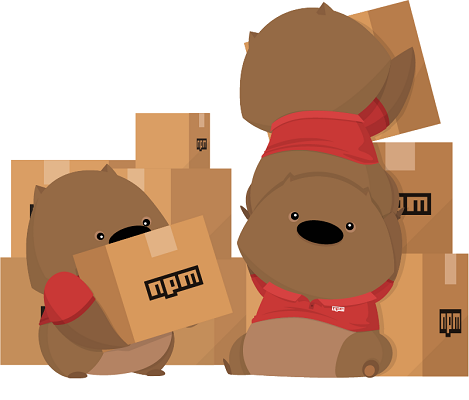
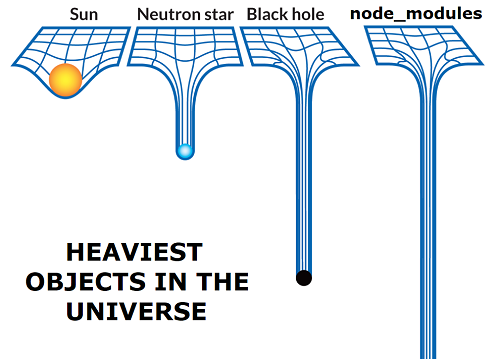

# Mise en place de l’environnement

Afin de suivre ce workshop dans des conditions optimales, nous vous recommandons de cloner ce dépôt sur votre propre ordinateur. Vous trouverez dans le dossier `Bases` le code de départ et le code de fin pour chaque étape du workshop. Cela vous permettra de continuer à suivre le parcours en cas de problème avec votre code.

## Initialiser un projet avec npm

### npm, c’est quoi ?

Lorsque vous travaillez sur un projet, il n’est pas toujours souhaitable de tout programmer par vous-même. Certaines choses sont trop compliquées ou trop longues à refaire, et vous préféreriez utiliser un code déjà tout fait pour vous simplifier la tâche. En d’autres mots, vous cherchez à utiliser des bibliothèques !

L’installation de bibliothèques (aussi appelées libraries, modules, packages…) peut parfois s’avérer périlleuse, surtout lorsqu’on travaille à plusieurs ! Il faut télécharger chacune des bibliothèques, s’assurer d’avoir la bonne version, les mettre dans le bon dossier… et croiser les doigts pour que tous les contributeurs à votre projet fassent ces choses correctement 😁

Heureusement, npm est là pour gérer ces difficultés à votre place ! npm (toujours écrit en minuscules) est le sigle pour **N**ode **P**ackage **M**anager, *gestionnaire de paquets de Node* en français. Un gestionnaire de paquets est un petit programme qui va s’occuper d’installer pour vous toutes les libraries utilisées par votre projet, ce qu’on appelle habituellement des *dépendances*. Avec npm, l’installation de toutes vos dépendances peut se faire en une simple commande dans le terminal !

|| 
|---|
||
|*Le wombat, mascotte de npm*|

### Création du package.json

Créez un nouveau dossier et ouvrez-y le terminal. Entrez ensuite la commande `npm init` et suivez les instructions pour générer un fichier `package.json` qui nous servira à gérer les dépendances. Si vous n’êtes pas très motivé à réfléchir, spammez `Enter`, la configuration par défaut fonctionne très bien aussi ! 😁
```
This utility will walk you through creating a package.json file.
It only covers the most common items, and tries to guess sensible defaults.

See `npm help json` for definitive documentation on these fields
and exactly what they do.

Use `npm install <pkg>` afterwards to install a package and
save it as a dependency in the package.json file.

Press ^C at any time to quit.
package name: (workshop)
version: (1.0.0)
description: Mon super projet !
git repository:
keywords: javascript, workshop
author: Louis
license: (ISC)
About to write to C:\DEV\projects\JavaScript\Node.js\Tests\workshop\package.json:

{
  "name": "workshop",
  "version": "1.0.0",
  "description": "Mon super projet !",
  "main": "index.js",
  "scripts": {
    "test": "echo \"Error: no test specified\" && exit 1"
  },
  "author": "Louis",
  "license": "ISC",
  "keywords": [
    "javascript",
    "workshop"
  ]
}


Is this OK? (yes)
```
… et notre `package.json` est déjà fin prêt ! 🥳 Essayons maintenant d’ajouter une dépendance ! Pour cet exemple, j’ai choisi `chalk`, un petit module qui va nous permettre de mettre en couleur nos console.log un peu plus facilement. Pour l’installer, il suffit d’entrer la commande `npm install chalk`.
```
C:\DEV\projects\JavaScript\Node.js\Tests\workshop>npm install chalk
npm notice created a lockfile as package-lock.json. You should commit this file.
npm WARN test@1.0.0 No description
npm WARN test@1.0.0 No repository field.

+ chalk@3.0.0
added 7 packages from 4 contributors and audited 7 packages in 0.804s

1 package is looking for funding
  run `npm fund` for details

found 0 vulnerabilities
```
Vous remarquez que deux nouveaux fichiers ont été ajoutés à notre projet 😮 Le premier est le `package-lock.json`, qui contient l’arborescence exacte de toutes les dépendances utilisées par le projet. L’autre est le `node_modules`, un gros dossier qui va contenir tout le code de nos dépendances. Le `node_modules` est réputé assez lourd, et il est vivement conseillé de l’ajouter au `.gitignore` lorsque vous travaillez avec git ! Lorsque nous devons partager un projet avec nos colaborateurs, nous leur envoyons uniquement le `package.json` et le `package-lock.json`. Il leur suffit ensuite de lancer la commande `npm install` pour que npm aille automatiquement récupérer et installer toutes les dépendances 😎




// TODO dossier public

// TODO installation globale et dev dependencies : installer nodemon