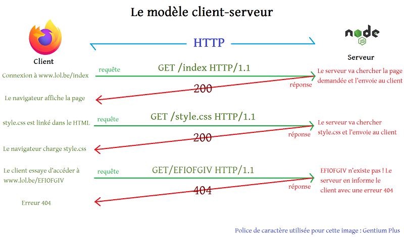

# Création d’un premier serveur

Nous allons maintenant attaquer l’une des parties les plus excitantes et les plus enrichissantes de Node.js : la création de notre propre serveur HTTP.

## Un serveur HTTP ?

HTTP est un protocole de réseau mis au point pour échanger des documents à travers le World Wide Web. Un protocole de réseau, c’est en fait une série de règles qui régissent la communication entre plusieurs appareils connectés. 

HTTP fonctionne suivant ce qu’on appelle le **modèle client-serveur** : un programme, appelé **client** envoie des demandes (appelées **requêtes**), tandis qu’un autre programme, appelé **serveur**, est à l’écoute des requêtes du client afin de lui envoyer une **réponse**.



Un serveur HTTP est donc un programme qui va écouter les requêtes des clients et élaborer une réponse adéquate.

## Développement d’un serveur HTTP

### Créer le serveur

```javascript
"use strict";

const http = require("http"); /* Récupère le module http */
const server = http.createServer(); /* Crée une nouvelle instance de http.Server */

server.listen(8080, () => console.log("Serveur démarré !")); /* Écoute le port 8080 */
```

Pour créer notre serveur, nous allons avoir besoin de quelques fonctionnalités de Node.js ! Nous allons donc faire appel au module `http`, qui contient toutes les méthodes et classes nécessaires pour manipuler HTTP. Pour importer un module, on utilise la fonction `require`, et nous lui indiquons en argument le nom du module à aller chercher, ici, `http`, que nous stockons dans une variable. 

Nous faisons ensuite appel à la méthode `createServer()` qui fonctionne comme un constructeur et renvoie une instance de `http.Server`. Nous stockons cette instance dans une variable `server`, et nous appelons la méthode `listen()`. La méthode `listen()` indique à notre serveur d’écouter les connexions sur un port en particulier. Nous lui donnons deux arguments : le port à écouter, et un callback à appeler une fois le port mis sous écoute.

#### Notion de port

Un port correspond au lieu d’échange entre deux programmes, en l’occurrence un client (navigateur) et un serveur (Node.js), et est identifié d’après un petit numéro. Par défaut, le numéro utilisé par HTTP est 80, mais pour du développement nous utiliserons plutôt 8080. Cela nous évite des collisions – au cas où le port 80 serait déjà pris – et nous épargne d’avoir à toucher aux ports système. Les ports système, connus sous le nom de `well-know ports`, sont tous les ports inférieurs à 1024. Ces ports sont réservés, vous aurez besoin des privilèges administrateurs pour les modifier.

Quelques exemples de ports :

|Numéro|Programme associé|
|---|---|
|21|FTP|
|25|SMTP|
|70|Gopher|
|80|HTTP|
|443|HTTPS|
|3306|MySQL|
|25565|Minecraft|

### Écouter les requêtes HTTP

Ajoutez le petit bout de code suivant à votre script :

```javascript
server.on("request", (request, response) => {
    console.log(request);
    console.log("J’ai reçu une requête !!!");
});
```

On utilise `on()` pour créer un nouveau *listener* qui écoute les événements `"request"`. Vous pouvez voir `on()` comme un équivalent node.js de `addEventListener()` 😉

À chaque fois que notre serveur reçoit une requête, il va déclencher un callback que nous allons utiliser pour élaborer une réponse à cette requête. 

Mais avant toute chose, ça ressemble à quoi, une requête ? Faisons un petit `console.log` de `request` et lançons notre code ! Entrez `node server.js` dans votre terminal pour démarrer le serveur, et ouvrez votre navigateur à l’adresse http://localhost:8080/.

Le navigateur mouline dans le vide, c’est normal, nous n’avons actuellement défini aucune réponse aux requêtes. Jetez un œil à votre terminal : un trèèès gros objet est apparu ! C’est en fait notre requête http, parsée sous forme d’un objet facilement exploitable par JavaScript. Sous forme brute, notre requête ressemblerait à ça :
```
GET / HTTP/1.1
Host: localhost:8080
User-Agent: Mozilla/5.0 (Windows NT 10.0; Win64; x64; rv:73.0) Gecko/20100101 Firefox/73.0
Accept: text/html,application/xhtml+xml,application/xml;q=0.9,image/webp,*/*;q=0.8
Accept-Language: fr,fr-FR;q=0.8,en-US;q=0.5,en;q=0.3
Accept-Encoding: gzip, deflate
Connection: keep-alive
Upgrade-Insecure-Requests: 1
DNT: 1


```
La première ligne, appelée *start-line*, nous renseigne sur trois éléments importants : 
+ la méthode : `GET`
+ l’URL de la requête : `/`
+ la version d’HTTP : `HTTP/1.1`

Ce qu’on appelle une méthode HTTP est en fait un petit mot, généralement un verbe, qui indique l’action à entreprendre par le serveur sur la ressource ciblée par l’URL. Ici, nous utilisons la méthode `GET` sur la ressource située à l’URL `/`, ce qui revient à demander au serveur l’accès à la page d’accueil du site.

Les lignes d’après sont ce qu’on appelle des *headers*, et contiennent des informations sur la requête, comme par exemple le navigateur utilisé ou le système d’exploitation de l’utilisateur.

Finalement, notre requête est terminée par deux lignes vides : la première ligne est toujours vide, elle sert de séparateur entre les headers et ce qu’on appelle le *body*, body qui correspond donc à notre seconde ligne. Le body contient habituellement les données jointes à la requête, par exemple celles d’un formulaire lors de son envoi. Ici, il s’agit d’une simple requête GET, nous n’avons aucune donnée à envoyer, le body est donc vide.

Essayons d’accéder à ces informations depuis l’objet `request` de Node.js ! Copiez/collez le bout de code ci-dessous, relancez votre script (`Ctrl` + `C` puis `node server.js`) et retournez à l’adresse http://localhost:8080/.
```javascript
"use strict";

// ...

server.on("request", (request, response) => {
    console.log("url: " + request.url);
    console.log("method: " + request.method);
    console.log(request.headers);
});
```